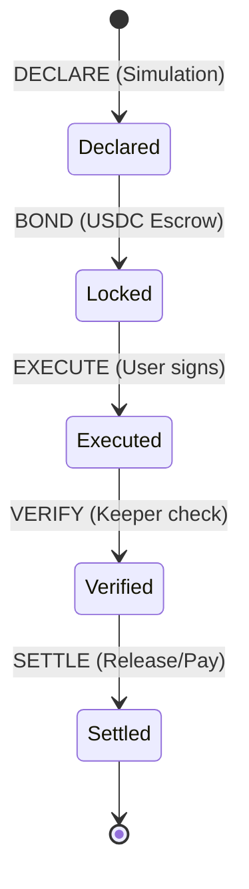

# Technical Architecture

Preview Bond uses a hybrid on-chain/off-chain architecture to provide economic verification for Solana transactions.

## 1. System Components

### On-Chain Program (Anchor/Rust)
The core logic resides in a Solana program that manages the lifecycle of the bond.
- **Bond Registry**: Stores `BondAccount` states including the `preview_digest` and the locked USDC.
- **Escrow**: Holds the USDC provided by the bond provider.
- **Settlement Engine**: Handles the distribution of funds based on Keeper attestations or multisig overrides.

### Off-Chain Simulator
The simulator provides the "truth" for the preview.
- **Simulation**: Uses `simulateTransaction` to predict the outcome of an unsigned tx.
- **Fingerprinting**: Extracts a structural summary:
    - List of all programs called.
    - All token transfers (mint, amount, from, to).
    - Account authority changes.
- **Hashing**: Creates a `preview_digest` of this fingerprint.

### Off-Chain Keeper
The Keeper is the monitoring agent that validates execution.
- **Monitoring**: Watches the Solana network for the `tx_digest` associated with a bond.
- **Verification**: Fetches the actual transaction via `getTransaction` and compares the inner instructions and account changes against the stored fingerprint.
- **Attestation**: Submits a signed attestation to the on-chain program (`MATCH` or `MISMATCH`).

## 2. Trust Boundaries & Enforcement

| Action | Enforced By | Trust Level |
|---|---|---|
| **Locking USDC** | On-chain Program | Trustless (Smart Contract) |
| **Simulation** | Simulator | Trusted (deterministic) |
| **Verification** | Keeper | Attested (Bonded) |
| **Final Settlement** | On-chain Program | Trustless (based on attestation) |
| **Dispute Resolution**| Team Multisig | Centralized (v1 only) |

## 3. State Machine: Bond Lifecycle



## 4. Data Structures

### BondAccount
```rust
pub struct BondAccount {
    pub provider: Pubkey,
    pub user: Pubkey,
    pub tx_digest: [u8; 32],
    pub preview_digest: [u8; 32],
    pub amount: u64,
    pub payout_cap: u64,
    pub status: BondStatus,
    pub expiry: i64,
}
```

## 5. Integration Flow
1. **User/Bot** calls Simulator $\rightarrow$ receives `preview_digest` and `tx_digest`.
2. **Provider** calls `bond_tx` $\rightarrow$ locks USDC $\rightarrow$ stores digests.
3. **User/Bot** executes the transaction on Solana.
4. **Keeper** detects the transaction $\rightarrow$ verifies outcome $\rightarrow$ calls `verify_tx`.
5. **Program** releases funds based on `verify_tx` result.
